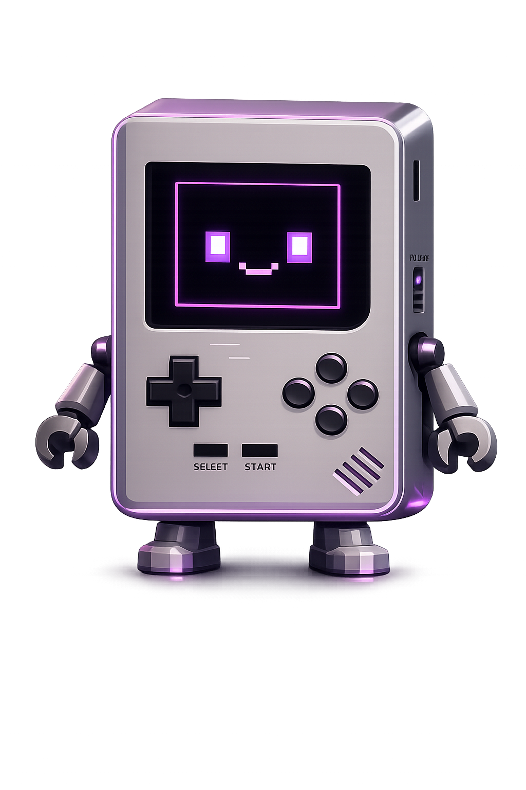

# Augusta Dev Hackathon Website

A retro-styled hackathon website for Augusta-area developers.

This project is being built as a creative front-end experience for discovering hackathons, signing in, exploring a profile page, and eventually giving admins tools to manage events. The visual direction intentionally leans into retro gaming, CRT screens, and early-console UI while still feeling modern enough to expand with AI features later.

## Project Goal

Build a community-facing website for Augusta developers that:

- showcases a strong landing experience
- gives users a dedicated hackathons page
- provides a profile experience for participants
- grows into an AI-assisted platform for users and admins

Planned AI direction:

- creative tools for users
- admin support for creating and managing hackathons
- a bot character named `Glitchy` as part of the experience

## Glitchy

Glitchy is planned, but not stable yet.

Current asset:



## Tech Stack

<p>
  
  
  
  
  
  
  
</p>

- `React 19`
- `TypeScript`
- `Vite`
- `React Router`
- `Supabase` for authentication/session handling
- `Three.js`
- `lucide-react`

Notable front-end work in this project:

- custom `Three.js` hero work
- GLTF-based 3D scene loading
- custom CRT / old-monitor overlay effects
- retro loading and transition treatments

## New Tech I Was Excited To Try

This project was a chance to experiment with tools and ideas that felt much more visual and interactive than a standard app build.

- `Three.js` was one of the biggest ones. It brought the landing hero to life and pushed the project beyond a normal static website.
- Custom CRT effects were another big step. Building the old-screen feel, scanlines, distortion, and retro transitions made the UI feel much more intentional.
- `Supabase` auth is also in the project, which gave the site a real signed-in / signed-out flow instead of staying purely static.

## Theme and Visual Direction

The site is intentionally retro.

Current directions across the project:

- arcade / CRT / old-TV influence
- retro console inspiration
- PS1-inspired treatment on the profile page
- synthwave / neon accents on the hackathon experience

The goal is not a plain corporate hackathon site. It is meant to feel playful, nostalgic, and a little experimental.

## Colors Used

Core colors already defined in the project include:

| Color | Name | Hex |
|---|---|---|
| <span style="display:inline-block;width:48px;height:16px;background:#FF5C00;border:1px solid #999;"></span> | Nick orange | `#FF5C00` |
| <span style="display:inline-block;width:48px;height:16px;background:#FFD200;border:1px solid #999;"></span> | Yellow | `#FFD200` |
| <span style="display:inline-block;width:48px;height:16px;background:#97FF00;border:1px solid #999;"></span> | Green | `#97FF00` |
| <span style="display:inline-block;width:48px;height:16px;background:#FF00E5;border:1px solid #999;"></span> | Magenta | `#FF00E5` |
| <span style="display:inline-block;width:48px;height:16px;background:#00E0FF;border:1px solid #999;"></span> | Cyan | `#00E0FF` |
| <span style="display:inline-block;width:48px;height:16px;background:#8B00FF;border:1px solid #999;"></span> | Purple | `#8B00FF` |
| <span style="display:inline-block;width:48px;height:16px;background:#0066FF;border:1px solid #999;"></span> | Blue | `#0066FF` |
| <span style="display:inline-block;width:48px;height:16px;background:#FF007A;border:1px solid #999;"></span> | Pink | `#FF007A` |
| <span style="display:inline-block;width:48px;height:16px;background:#333333;border:1px solid #999;"></span> | Dark border | `#333333` |

Additional theme directions already in use:

- dark CRT blacks and deep violets
- neon cyan / magenta / electric blue gradients
- metallic PS1-inspired blue-gray surfaces on the profile page

## Fonts Used

Fonts currently used in the project styles include:

- `Inter`
- `Outfit`
- `Bungee`
- `Press Start 2P`
- `Space Mono`

These are used to balance:

- readable UI copy
- punchy retro headings
- arcade / terminal / console-inspired accents

## What Has Been Built

- A cinematic retro landing hero page
- A dedicated hackathons page
- A profile page
- Auth modal flows for sign in / sign up
- Route navigation between landing, hackathons, profile, and admin
- CRT / retro screen effects and transitions

## Current Build Status

### Completed

- [x] Landing page / hero experience
- [x] Standalone hackathons page
- [x] Profile page
- [x] Supabase auth integration for sign-in state
- [x] Retro transitions and visual effects
- [x] Responsive front-end structure for the major pages

### In Progress / Placeholder

- [x] Admin route exists
- [ ] Admin portal is not built yet
- [ ] AI bot experience is not built yet
- [ ] AI admin tooling is not built yet
- [ ] Real hackathon data pipeline is not connected yet
- [ ] Real profile data persistence is not connected yet

## Data / Backend Status

This part matters and should be stated clearly:

- `Supabase auth` is connected and used for session state, sign in, sign up, and sign out.
- The `admin page` is currently just a stub.
- The `profile page` uses hardcoded UI data for stats, projects, skills, teammates, and activity. It only derives the displayed user name from the current auth session when available.
- The `hackathons page` currently uses hardcoded event and filter data inside the React component.
- `src/data/sample_data.json` exists, but it is currently empty and not wired into the UI.

So the app is **not fully data-connected yet**. Auth is real. Most displayed content is still placeholder / hardcoded front-end content at this stage.

## Important Project Files

- `src/pages/HackathonPage/HackathonPage.tsx`  
  Landing page and hero experience

- `src/pages/HackathonSectionPage/HackathonSectionPage.tsx`  
  Standalone hackathons route wrapper

- `src/components/HackathonSection.tsx`  
  Hackathons page content

- `src/pages/Profile/Profile.tsx`  
  Profile page

- `src/pages/AdminPage/AdminPage.tsx`  
  Admin page stub

- `src/components/auth/AuthModal.tsx`  
  Sign in / sign up modal

- `src/components/hero/HeroCanvas.tsx`  
  Main 3D hero work

- `src/components/crt/CrtScrollList.tsx`  
  CRT-style scroll treatment

## Assets Already in the Repo

- `public/glitchy/Glitchy.png`
- `public/oldTV/...`
- `public/ps1/...`
- `public/ps2/...`
- `public/AugustaDevHeader.png`
- `public/SelectAHackathon.png`
- `public/video/...`

These support the retro direction and 3D / console-inspired presentation.

## What Still Needs To Be Built

- AI bot experience for users
- Admin portal
- Real event creation / management workflow
- Data-backed hackathon listings
- Connected profile data
- Cleaner backend-driven content flow

## Running Locally

```bash
npm install
npm run dev
```

Production build:

```bash
npm run build
```

## Notes

- The project currently builds successfully.
- There are still existing CSS warnings in `src/index.css` related to `@theme` and `@apply`.
- Those warnings are known and separate from the current front-end work documented here.
